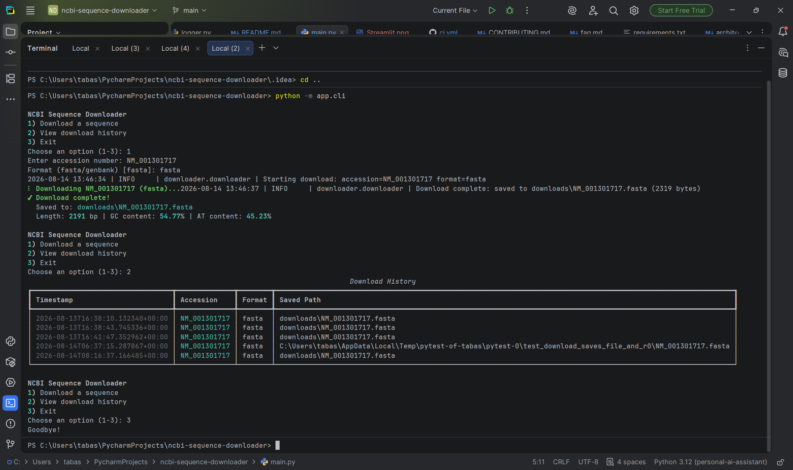

# 🧬 NCBI Sequence Downloader

A production-quality Python tool for downloading DNA, RNA, and protein sequences directly from NCBI, with input validation, sequence statistics, metadata extraction, download history, and both a CLI and a web GUI.


## Table of Contents

- [Features](#features)
- [Screenshots](#screenshots)
- [Architecture](#architecture)
- [Installation](#installation)
- [Usage](#usage)
- [Running Tests](#running-tests)
- [Project Structure](#project-structure)
- [Roadmap](#roadmap)
- [FAQ](#faq)
- [Contributing](#contributing)
- [License](#license)

## Features

- 🔍 Search and download sequences by accession number
- 📄 Download in FASTA or GenBank format
- ✅ Input validation with clear, actionable error messages
- 📊 Sequence statistics: length, GC content, AT content, base composition
- 🧬 Metadata extraction: organism, gene name, taxonomy, references
- 📜 Persistent download history (JSON)
- 🖥️ Command-line interface with `argparse` and an interactive menu mode
- 🌐 Web GUI built with Streamlit
- 🧪 Automated test suite with mocked network calls (no live API needed to test)
- 📝 Structured logging to console and file

## Screenshots

| CLI | Web GUI |
|---|---|
|  |  |

## Architecture

The project follows a layered architecture, with a single core package (`downloader/`) shared by two independent front-ends (CLI and Streamlit) — neither interface contains business logic; both are thin layers over the same tested core.

```
┌─────────────────┐     ┌──────────────────────┐
│   app/cli.py     │     │ app/streamlit_app.py  │
│   (CLI)          │     │ (Web GUI)              │
└────────┬─────────┘     └──────────┬─────────────┘
         │                          │
         └───────────┬──────────────┘
                      ▼
         ┌────────────────────────┐
         │   downloader/           │  <- core package, fully tested,
         │   ├── downloader.py      │     zero knowledge of any UI
         │   ├── entrez_client.py    │
         │   ├── validator.py         │
         │   ├── parser.py              │
         │   ├── statistics.py            │
         │   ├── metadata.py                │
         │   ├── history.py                  │
         │   ├── config.py                     │
         │   ├── file_manager.py                 │
         │   ├── logger.py                         │
         │   └── exceptions.py                       │
         └────────────┬────────────┘
                      ▼
              NCBI Entrez API
              (via Biopython)
```

See [docs/architecture.md](docs/architecture.md) for a deeper technical breakdown of each module's responsibility.

## Installation

**Requirements:** Python 3.12+, a free NCBI account email (no API key required, though one is recommended for higher rate limits).

```bash
# Clone the repository
git clone https://github.com/<your-username>/ncbi-sequence-downloader.git
cd ncbi-sequence-downloader

# Create and activate a virtual environment
python -m venv venv
source venv/bin/activate      # Windows: venv\Scripts\activate

# Install dependencies
pip install -r requirements.txt

# Configure your environment
cp .env.example .env
# then edit .env and set ENTREZ_EMAIL=your_real_email@example.com
```

## Usage

### CLI

```bash
# Direct download
python -m app.cli --accession NM_001301717 --format fasta

# View download history
python -m app.cli --history

# Interactive guided menu
python -m app.cli

# Full help
python -m app.cli --help
```

### Web GUI

```bash
streamlit run app/streamlit_app.py
```

Then open `http://localhost:8501` in your browser.

## Running Tests

```bash
pytest -v
```

All tests run offline — network calls to NCBI are mocked, so the suite runs in under a second with no live API dependency.

## Project Structure

```
ncbi-sequence-downloader/
├── app/                  # User-facing interfaces (CLI, Streamlit)
├── downloader/            # Core package: all business logic, fully tested
├── tests/                   # Pytest suite
├── docs/                      # Extended documentation
├── screenshots/                 # README screenshots
├── .streamlit/config.toml         # Streamlit theme
├── requirements.txt
└── README.md
```

## Roadmap

- [ ] Batch downloading via CSV input
- [ ] Retry logic with exponential backoff for network failures
- [ ] SQLite-backed history as an alternative to JSON
- [ ] Gene ID search support in the CLI and GUI
- [ ] GitHub Actions CI pipeline

## FAQ

See [docs/faq.md](docs/faq.md).

## Contributing

Contributions are welcome. See [CONTRIBUTING.md](CONTRIBUTING.md) for guidelines.

## License

Distributed under the MIT License. See [LICENSE](LICENSE) for details.